% Arquitectura Web
% Adolfo Sanz De Diego
% Enero 2014

# Acerca de

## Índice

-  Acerca de

-  Introducción

-  Historia evolutiva de la Web

-  Arquitectura web

-  Entorno de ejecución en servidor

-  Tecnologías de servidor

-  Entorno de ejecución en cliente

-  Tecnologías de cliente

## Adolfo Sanz De Diego

**Antiguo programador web JEE**

Hoy en día:

-  **Profesor de FP de informática**:
    - Hardware, Sistemas Operativos
    - Redes, Programación

-  **Formador Freelance**:
    - Java, Android
    - JavaScript, jQuery
    - JSF, Spring, Hibernate
    - Groovy & Grails

-  **Me gusta programar**

## Hackalover

**Para los amantes de los hackathones**.

-  **Meetup**:   [http://www.meetup.com/Hackathon-Lovers/](http://www.meetup.com/Hackathon-Lovers/)

-  **LinkedIn**: [http://www.linkedin.com/groups/Hackathon-Lovers-6510465](http://www.linkedin.com/groups/Hackathon-Lovers-6510465)

-  **Tumblr**:   [http://hackathonlovers.tumblr.com/](http://hackathonlovers.tumblr.com/)

-  **Twitter**:  [http://twitter.com/HackathonLovers](http://twitter.com/HackathonLovers)

-  **YouTube**:  [http://www.youtube.com/channel/UCRwSe7jK-y62BMvIiNBV1qw](http://www.youtube.com/channel/UCRwSe7jK-y62BMvIiNBV1qw)

## Tweets Sentiment

Es un **analizador de tweets** que extrae información semántica para conocer
si el sentimiento general de los tweets de un determinado tema
es positivo o negativo.

-  **Web**: [http://tweetssentiment.com/](http://tweetssentiment.com/)

-  **Twitter**: [http://twitter.com/TweetsSentiment](http://twitter.com/TweetsSentiment)

## ¿Donde encontrarme?

Mi nick: **asanzdiego**

-  AboutMe:    [http://about.me/asanzdiego](http://about.me/asanzdiego)

-  Blog:       [http://asanzdiego.blogspot.com.es](http://asanzdiego.blogspot.com.es)

-  GitHub:     [http://github.com/asanzdiego](http://github.com/asanzdiego)

-  Google+:    [http://plus.google.com/+AdolfoSanzDeDiego](http://plus.google.com/+AdolfoSanzDeDiego)

-  LinkedIn:   [http://www.linkedin.com/in/asanzdiego](http://www.linkedin.com/in/asanzdiego)

-  SlideShare: [http://www.slideshare.net/asanzdiego](http://www.slideshare.net/asanzdiego)

-  Twitter:    [http://twitter.com/asanzdiego](http://twitter.com/asanzdiego)

## Créditos

Agradecimientos a **Micael Gallego** ([http://twitter.com/micael_gallego](http://twitter.com/micael_gallego))

-  [Introducción a las aplicaciones web](http://www.slideshare.net/micaelgallego/qu-es-la-web-30036167)

-  [Tecnologías de desarrollo de aplicaciones web)](http://www.slideshare.net/micaelgallego/tema2-tecnologas-de-desarrollo-de-aplicaciones-web)

Estas **transparencias** están hechas con:

-  [https://github.com/asanzdiego/marckdownslides](https://github.com/asanzdiego/marckdownslides)

## Licencia

Estas **transparencias** están bajo una licencia:

-  [Creative Commons Reconocimiento-CompartirIgual 3.0](http://creativecommons.org/licenses/by-sa/3.0/es/)

El **código** de los programas están bajo una licencia:

-  [GPL 3.0](http://www.viti.es/gnu/licenses/gpl.html)

## Fuentes

-  [SlideShare](http://www.slideshare.net/asanzdiego/arquitectura-web)

-  [Deck Slides](http://asanzdiego.github.io/arquitectura-web/slides/export/arquitectura-web-deck-slides.html)

-  [Reveal Slides](http://asanzdiego.github.io/arquitectura-web/slides/export/arquitectura-web-reveal-slides.html)

-  [Plain HTML](http://asanzdiego.github.io/arquitectura-web/slides/export/arquitectura-web.html)

# Introducción

## ¿Qué es Internet?

Internet es un conjunto descentralizado de **redes de comunicación interconectadas** que utilizan la familia de protocolos TCP/IP.

Funciona como una **red lógica única**, de alcance **mundial**, aunque esté formada por multitud de redes físicas **heterogéneas**.

Uno de los servicios que más éxito ha tenido en Internet ha sido la **World Wide Web** (WWW, o "la Web"), aunque es habitual la confusión entre ambos términos por gente no experta.

## ¿Qué es La Web?

La Web es un conjunto de protocolos, estándares y tecnologías, basadas en Internet, diseñado originalmente para la consulta remota de información en **archivos de hipertexto**.

## Otros servicios

Existen muchos otros servicios y protocolos en Internet:

-  Envío y recepción de correo electrónico (POP3, IMAP, SMTP)

-  Transmisión de archivos (SSH, FTP, P2P, HTTP)

-  Conexión remota por consola (SSH, Telnet)

## La Web 1.0

Al principio, el **usuario sólo leía contenido** publicado por otros. Era un contenido muy estático, y muy difícil de editar por el propio usuario.

El navegador web era la única aplicación "conectada", y hay que reconocerlo... la web era sobre todo para Frikis.

## Las cosas empiezan a cambiar

Poco a poco las tecnologías se desarrollan y los **usuarios empiezan a tener más facilidades para editar el propio contenido**.

Google se empieza a popularizar, nace Blogger, WordPress, la Wikipedia, LinkedIn...

## Nace la Web 2.0

En 2004 Dale Dougherty (O'Reilly) acuña el término Web 2.0 para referirse a La Web como una plataforma con aplicaciones ligeras, dinámicas y en constante evolución.

Con la Web 2.0, las páginas web dejan de ser simples documentos online para convertirse en aplicaciones web, y es entonces cuando los **usuarios toman el control de los contenidos**.

## Web 1.0 VS Web 2.0

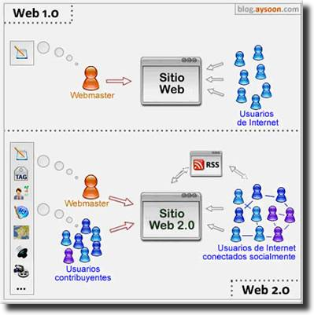

# Historia evolutiva de la Web

## Los orígenes de Internet

En **1962**, a causa de la guerra fría con la URSS, las Fuerzas Aéreas de Estados Unidos pidieron a un reducido grupo de investigadores que creara una **red de comunicaciones militares que pudiera resistir un ataque nuclear**.

En **1964**, **Paul Baran** tuvo la idea de crear una **red en forma de telaraña**. El concepto de esta red se basaba en un sistema descentralizado, de manera que la red pudiera seguir funcionando aunque se destruyeran uno o varios equipos.

## Arpanet (1969)

En **1969**, el proyecto militar ARPA (Agencia de Proyectos de Investigación Avanzados, una división del Ministerio de Defensa de Estados Unidos) creó la red experimental **ARPANET** cuyo fin era conectar las principales universidades de EEUU.

## Nace La Web (1989)

En **1989**, **Tim Berners-Lee junto a Robert Cailliau crean la World Wide Web**. Habilitaron los dominios o direcciones con letras (en vez de los complejos códigos IP). También inventaron los enlaces. Esto marcó el nacimiento de La Web como lo conocemos hoy en día.

## Yahoo (1994)

En **1994**, **Jerry Yang y David Filo**, estudiantes de Stanford, crean **Yahoo!** un directorio de sitios según la categoría de su contenido, para así intentar poner orden dentro del bazar, cada día más extenso, que se estaba convirtiendo Internet.

## Hotmail (1996)

En **1996**, se lanzó **Hotmail** el correo electrónico gratuito de **Microsoft**.

## Google (1997)

En **1997**, **Larry Page y Sergey Brin**, dos estudiantes de Stanford, crean **Google**, un sistema que analiza los enlaces que conectan los sitios de Internet para hallar información de manera efectiva.

## Las '.com' (1998)

En **1998**, bancos e inversionistas volcaron miles de millones de dólares al financiamiento de todo tipo de empresas basadas en la Red, conocidas como **las 'punto-com'**.

## Napster (1998)

En **1998**, **Sean Parker y Shawn Fanning** crean **Napster** uno de los primeros programas **P2P**.

## XMPP (1999)

En **1999**, nace **XMPP**, un protocolo abierto ideado para la **mensajería instantánea**.

## Blogger (1999)

En **1999**, también nace **Blogger**, un servicio web para gestionar blogs.

## La burbuja (2001)

En **2001**, **estalla la burbuja de las 'punto-com'** que llevó a la quiebra a la mayoría.

## Wikipedia (2001)

En **2001**, salió a la luz **Wikipedia**, una enciclopedia virtual que a diario se alimenta y se corrige por sus propios usuarios.

## The Pirate Bay (2003)

En **2003**, nace en Suecia el portal de búsqueda de torrents **The Pirate Bay**.

## LinkedIn (2003)

En **2003**, se lanza la red social de contactos profesionales **LinkedIn**.

## WordPress (2003)

En **2003**, se lanza la plataforma de gestión de blogs **WordPress**.

## GMail (2004)

En **2004**, nace **GMail** el correo electrónico gratuito de **Google**.

## Facebook (2004)

En **2004**, **Mark Zuckerberg**, estudiante de la Universidad de Harvard, crea **Facebook**, una de las redes sociales más conocidas.

## Youtube (2005)

En **2005**, con el auge de la banda ancha, el vídeo en línea deja de ser una utopía y ve la luz el famoso portal de **Youtube**.

## Twitter (2006)

En **2006**, **Jack Dorsey** lanza la famosa red social de microblogging **Twitter**.

## Hoy

En **2009**, Internet supera los **180 millones de sitios web**.

En **2012**, **Facebook supera los 1000 millones de usuarios**, y está traducido a 70 idiomas.

En **2013**, **LinkedIn supera los 225 millones de usuarios** en más 200 países y territorios.

En **2013**, **Twitter supera los 280 millones de usuarios activos**, y los 480 millones de perfiles.

En **2013**, se superan los **1000 millones de dispositivos Android** en el mundo.

# Arquitectura web

## Cliente-servidor

La arquitectura web es una arquitectura cliente-servidor formada por los siguientes elementos:

-  **Un navegador**: Hace de cliente y realiza peticiones solicitando recursos a los servidores web.

-  **Un servidor web**: Recibe peticiones de clientes y responde a esas peticiones enviado un recurso o notificando un error.

-  **El protocolo http**: Es el protocolo basado en TCP/IP que se utiliza para que el navegador realice las peticiones al servidor web y este responda.

## Páginas estáticas

En los comienzos de la web, todos los sitios web eran conjuntos de páginas web en forma de ficheros HTML.

Los sitios web **eran como libros** pero con navegación mediante enlaces en vez de navegación secuencial.

La edición de sitios web se realizaba con herramientas similares a la edición de documentos (p.e. Microsoft FrontPage)

A estas páginas se las denominaba **páginas web estáticas**.

## Páginas dinámicas

Poco a poco las páginas **empezaron a ser más dinámicas**.

En vez de ser ficheros HTML en el disco, empezaban a ser pequeños programas que se ejecutaban cada vez que un usuario pedía una página.

Inicialmente eran cambios mínimos (contador de visitas, fecha actual, cambiar la imagen de cabecera,...) con lenguajes de script como PERL y PHP.

## Aplicaciones web

Los cambios serían cada vez más profundos y las páginas web se convertirían en completas aplicaciones web.

Una aplicación web es aquella que los usuarios utilizan **accediendo a un servidor web** a través de Internet mediante un navegador.

Tienen la ventaja de ser independientes del Sistema Operativo, y de que son fáciles de actualizar y mantener.

# Entorno de ejecución en servidor

## Servidores web estáticos

Al principio, la forma de trabajar con los serivoderes web era de la siguiente forma:

-  Primero, el navegador hace una petición al servidor mediante http.

-  Seguidamente, el servidor transforma la URL en una ruta el sistema de archivos y devuelve el archivo al navegador.

En este caso, para **una misma URL el servidor siempre va a devolver el mismo recurso**, siendo normalmente estos recursos ficheros HTML, CSS, JavaScript, imágenes...

## Servidores web dinámicos

Pero hoy en día, la mayoría de los servidores web permiten que en cada petición se ejecute un programa que genera dinámicamente el recurso que se envía al usuario (server-side scripting).

Ahora para **una misma URL el servidor puede devolver un recurso distinto**.

A este contenido generado "al vuelo" se le denomina **contenido dinámico**, en contraposición al contenido estático obtenido del sistema de archivos.

Es bastante habitual que el contenido dinámico se genere con la información de una **base de datos**.

Los servidores web con contenido dinámico no sólo envían recursos al navegador, **también pueden procesar información que les llega** del mismo:

-  Datos contenidos en formularios web.

-  Ficheros enviados desde el navegador.

-  Información codificada en los enlaces que pulsan los usuarios.

Esta funcionalidad permite el desarrollo de completas **aplicaciones web**.

## Historia de los servidores web

Los principales servidores web son o han sido:

-  CERN httpd (1990)

-  Apache (1995)

-  IIS (1995)

-  NginX (2004)

### CERN httpd (1990)

Creado por Tim Berners-Lee y otros, fué **el primer servidor web**.

Al principio sólo corría en ordenadores NeXTSTEP, pero más adelante fue portado a otros sistemas.

En agosto de 1991, Tim Berners-Lee anunció la disponibilidad del código fuente y del software World Wide Web desde el sitio FTP CERN.

El desarrollo del CERN httpd fue adquirido por W3C y la última versión es 1996, y hoy está totalmente en desuso.

### Apache (1995)

Lanzado en **1995** y desarrollado por la Apache Software Fundation, hoy en  día es el **servidor más popular** (Enero de 2014 con 42% cuota)

Es un servidor web multiplataforma y con una licencia de Software Libre (Apache License)

Su nombre completo es Apache HTTP Server Project.

### IIS (1995)

Lanzado también en **1995** y desarrollado por Microsoft, hoy en día es el **segundo servidor más usado** (Enero de 2014 con 30% cuota)

Está integrado en Windows Server, y se compagina bien con la base de datos MS SQL Server.

Su nombre completo es Microsoft Internet Information Services.

### NginX (2004)

Lanzado en **2004** y desarrollado por el ruso Igor Sysoev, hoy en día es el **tercer servidor más usado** a (Enero de 2014 con 14% cuota)

Es un servidor multiplataforma y con una licencia de Software Libre (tipo BSD)

Es muy rápido y se suele usar como balanceador de carga.

## Cuota servidores web

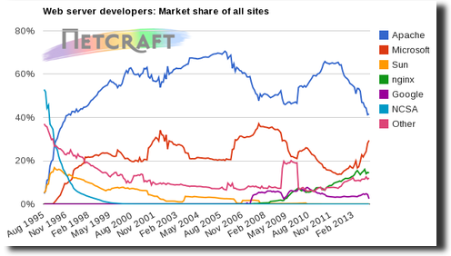

[http://news.netcraft.com](http://news.netcraft.com)

# Tecnologías de servidor

## Introducción

Los estándares son muy importantes en los navegadores web (HTML, CSS, JavaScript) porque la web tiene
que ser compatible con cualquier dispositivo.

En cambio los estándares no son tan necesarios en el servidor, y **cada organización desarrolla su servidor con la tecnología de su elección**.

## Cuotas tecnologías

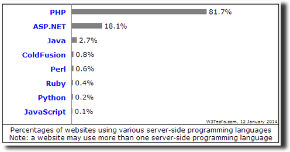

[http://w3techs.com](http://w3techs.com)

Existen multitud de tecnologías de construcción de aplicaciones web en el servidor, siendo **las más usadas**:

-  PHP, ASP.NET, Java EE.

## Otras tecnologías

Existen otros menos usadas, pero con un **gran crecimiento** de pupularidad:

-  Ruby on Rails, Grails (Groovy), Django (Python), Node (JavaScript), etc.

## PHP

PHP (acrónimo recursivo que significa PHP Hypertext Pre-processor) es un lenguaje de programación originalmente **diseñado para el desarrollo web de contenido dinámico**.

Fue uno de los primeros en permitir combinarse con el HTML del propio documento.

Fue creado originalmente por Rasmus Lerdorf en 1994 y actualmente el lenguaje sigue siendo desarrollado con una licencia libre (PHP license) por la comunidad en PHP Group, pues **no existe un organismo de estandarización**.

Puede ser usado en la mayoría de los servidores web y en casi todos los sistemas operativos sin **ningún costo**.

Ejemplos como **Facebook o Wordpress** son sin duda una muestra importante de la popularidad de PHP.

Es la tecnología de programación del lado del servidor **más usada** en el pasado y en el presente.

Se integra normalmente con Apache y MySQL en entornos Linux en un paquete llamado **LAMP**

Existen **multitud de frameworks** para el desarrollo de aplicaciones PHP: CakePHP, CodeIgniter, Symfony, YiiZend, etc.

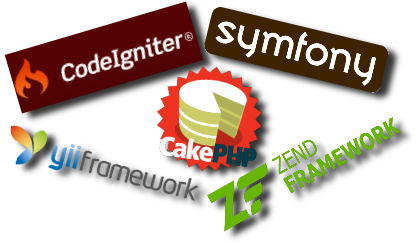

## ASP.NET

ASP.NET es un framework para aplicaciones web **desarrollado por Microsoft** y usado para construir páginas web dinámicas.

Es sucesora de la tecnología Active Server Pages (ASP), tiene una licencia propietaria y está pensada para ser usada en plataformas Windows.

Está pensada para ser programado en el lenguaje C#, aunque permite cualquier lenguaje de la plataforma .NET.

La mayoría de las librerías para ASP.NET son las oficiales proporcionadas por Microsoft:

-  **Web Pages**: permite combinar HTML con código ASP (similar a JSP y PHP)

-  **Web Forms**: permite construir aplicaciones web basadas en componentes (similar a JSF)

-  **MVC Framework**: permite desarrollar aplicaciones web usando el patrón modelo-vista-controlador

-  **AJAX**: permite la actualización de datos sin la recarga completa de una página web.

-  **Entity Framework**: permite mapear objetos al paradigma relacional (similar a JPA)

-  **Dynamic Data**: permite crear aplicaciones web orientadas a datos (similar a Ruby on Rails)

## Java EE

Java es un lenguaje de programación de **propósito general**, concurrente, orientado a objetos y basado en clases creado por James Gosling de Sun Microsystems y publicado en 1995.

Sus componentes son generalmente compiladas a bytecode para que puedan ejecutarse en cualquier máquina virtual Java (**JVM**) sin importar la arquitectura de la computadora subyacente.

Java junto con C es el **lenguaje más popular** en el índice TIOBE.

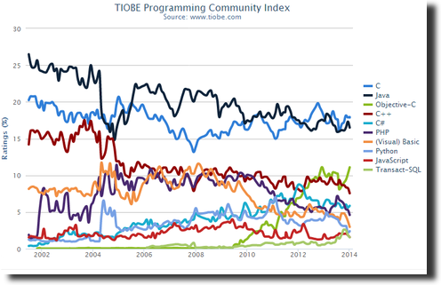

[http://www.tiobe.com/](http://www.tiobe.com/)

Java EE es la **edición empresarial** de la plataforma Java (lenguaje + JVM + bibliotecas), y está desarrollada por una coalición de empresas lideradas por Oracle, IBM, Red Hat, etc.

Es una tecnología muy usada a nivel empresarial, y **bastante estandarizada** pues tiene una organización de estandarización propia llamada Java Community Process (**JCP**) que define los estándares de la plataforma.

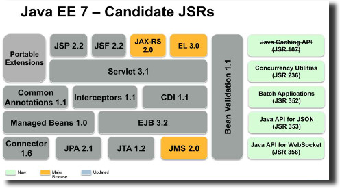

Estándares más importantes en Java EE:

-  **Servlets**: permite ejecutar de código Java ante una petición web en un servidor Java EE.

-  **Applets**: permite ejecutar de código Java dentro de un navegador web.

-  **JSP (Java Server Pages)**: permite combinar HTML con código Java para generar páginas web dinámicas.

-  **JDBC (Java Database Conectivity)**: permite la conexión a bases de datos relacionales desde Java.

-  **JPA (Java Persistence API)**: permite mapear objetos al paradigma relacional (ORM, Object Relational Mapping)

-  **JSF (Java Server Faces)**: permite construir aplicaciones web basadas en componentes reutilizables.

-  **JMS (Java Messege Service)**: permite la creación y gestión de colas de mensajes entre aplicaciones.

Toda aplicación web Java EE tiene que ejecutarse en una **servidor de aplicaciones Java EE** (aunque luego se
integre en Apache, NginX o IIS)

Existen muchos tipos de servidores, dependiendo de sus funcionalidades/rendimiento y de su licencia/coste.

Para desarrollar aplicaciones Java EE se utilizan IDEs y plugins:

-  **Eclipse**: Fundación. Mucha diversidad, falta de integración. Software libre.

-  **Netbeans**: Oracle. Muy integrado. Software libre.

-  **IntelliJ**: Jetbrains. Muy integrado. Propietario.

## Bases de Datos

Las bases de datos tienen un papel muy importante en el desarrollo de aplicaciones web.

Las más populares han sido las bases de datos **relacionales**, pero cada vez más se usan las bases de datos **NoSQL**.

### BBDD relacionales

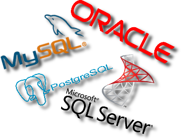

Son las bases de datos **más populares** en el desarrollo de aplicaciones.

En el lado del **software libre** las más usadas son: Postgre SQL y MySQL,

Y en lado del **software privativo** las más usadas son: Oracle y Microsoft SQL Server.

### BBDD NoSQL

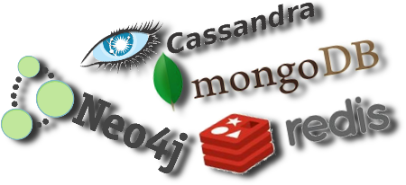

Como las aplicaciones web tienen muchas **necesidades de escalabilidad y tolerancia a fallos**, hay una nueva familia
de bases de datos que se denominan genéricamente NoSQL, que se puede interpretar como: 'No SQL' o como 'Not Only SQL'

#### Teorema CAP

El teorema CAP o teorema Brewer, dice que en **sistemas distribuidos** es imposible garantizar a la vez: consistencia, disponibilidad y tolerancia a particiones.

Definiciones:

-  **Consistencia**: al realizar una consulta o inserción siempre se tiene que recibir la misma información, con independencia del nodo o servidor que procese la petición.

-  **Disponibilidad**: que todos los clientes puedan leer y escribir, aunque se haya caído uno de los nodos.

-  **Tolerancia a fallos**: implica que el sistema tiene que seguir funcionando aunque existan fallos o caídas parciales que dividan el sistema.

Según las condiciones que cumplan:

-  **AP**: garantizan disponibilidad y tolerancia a fallos, pero no la consistencia. Algunas consiguen una consistencia parcial a través de la replicación y la verificación.

-  **CP**: garantizan consistencia y tolerancia a fallos. Para lograr la consistencia a través de los nodos, sacrifican la disponibilidad.

-  **CA**: garantizan consistencia y disponibilidad, pero tienen problemas con la tolerancia a fallos. Este problema lo suelen gestionar replicando los datos.

#### Tipos de BD NoSQL

Existen 4 tipos de bases de datos NoSQL:

-  **Orientadas a documentos**

-  **Orientadas a columnas**

-  **De clave valor**

-  **En grafo**

##### Orientadas a documentos

**Gestionan datos semi estructurados** almacenados en algún formato estándar como XML o JSON. Son las más versátiles y se pueden utilizar en muchos proyectos, incluso aquellos que tradicionalmente funcionarían sobre bases de datos relacionales.

En esta categoría encontramos:

-  **MongoDB**: probablemente la más famosa del momento. Algunas compañías la utilizan son Foursquare o eBay.

-  **CouchDB**: es de Apache y sus datos son accesibles vía una API REST. Es utilizada por compañías como Credit Suisse y la BBC.

##### Orientadas a columnas

Están pensadas para realizar consultas y agregaciones sobre grandes cantidades de datos. Funcionan de forma parecida a las bases de datos relacionales, pero almacenando **columnas de datos en lugar de registros**.

En esta categoría encontramos: 

-  **Cassandra**: incluida en esta sección, aunque en realidad sigue un modelo híbrido entre orientada a columnas y clave-valor. Es utilizada por Facebook y Twitter.

-  **HBase**: Escrita en Java y mantenida por el Projecto Hadoop de Apache, se utiliza para procesar grandes cantidades de datos. La utilizan Facebook, Twitter o Yahoo.

##### De clave valor

Son las más sencillas de entender. Simplemente **guardan tuplas que contienen una clave y su valor**. Cuándo se quiere recuperar un dato, simplemente se busca por su clave y se recupera el valor.

En esta categoría encontramos: 

-  **DynamoDB**: desarrollada por Amazon, es una opción de almacenaje que podemos usar desde los Amazon Web Services. La utilizan el Washington Post y Scopely.

-  **Redis**: desarrollada en C y de código abierto, es utilizada por Craiglist y Stack Overflow (a modo de caché).

##### En grafo

Basadas en la teoría de grafos **utilizan nodos y aristas** para representar los datos almacenados. Son muy útiles para guardar información en modelos con muchas relaciones, como redes y conexiones sociales.

En esta categoría encontramos: 

-  **Infinite Graph**: escrita en Java y C++ por la compañía Objectivity. Tiene dos modelos de licenciamiento: uno gratuito y otro de pago.

-  **Neo4j**: base de datos de código abierto, escrita en Java por la compañía Neo Technology. Utilizada por compañías como HP, Infojobs o Cisco.

# Entorno de ejecución en cliente

## Páginas web estáticas

Son páginas en las que el navegador renderiza el **HTML con estilos CSS e imágenes pero sin JavaScript**.

En estas páginas, cada vez que el usuario hace clic en un enlace, el navegador recarga por completo la página web.

Las primeras páginas web eran así, y hoy **todavía se siguen utilizando bastante**: en páginas personales, en 'landings pages', en 'home pages', en páginas de documentación, etc.

## Páginas web dinámicas

El cliente es dinámico porque las páginas **incluyen código JavaScript** que se ejecuta en el navegador.

Dependiendo de cómo se use el JavaScript en el cliente, las aplicaciones se pueden dividir en tres tipos:

-  JavaScript para efectos gráficos.

-  JavaScript con peticiones en segundo plano (AJAX)

-  Single Page Application.

### JavaScript para efectos gráficos

JavaScript se diseñó, entre otras cosas, para **añadir efectos gráficos** básicos a las páginas cuando el CSS era muy limitado.

La gran mayoría de las aplicaciones web que existen en Internet utilizan JavaScript al menos con este propósito.

### JavaScript peticiones en segundo plano

JavaScript se usa también para no tener que recargar la página completa, realizando **peticiones en segundo plano** que actualizan sólo aquellas partes de la página necesarias.

A esta técnica se la conoce como AJAX (Asynchronous JavaScript And XML), y la gran mayoría de las aplicaciones de hoy en día lo usan para **mejorar la experiencia del usuario**.

### Single Page Application

En este caso, la aplicación web es un conjunto de recursos HTML y CSS estáticos que se cargan en el navegador, y el contenido dinámico se carga en segundo plano con JavaScript.

Una SPA es **una única página cuyo contenido va cambiando según el usuario interactúa** con botones, pestañas, etc.

## Historia de los clientes web

Los principales clientes web son o han sido:

-  Mosaic (1993)

-  Netscape Navigator (1994)

-  Internet Explorer (1995)

-  Opera (1996)

-  Mozilla Firefox (2002)

-  iPhone (2007)

-  Android (2008)

-  Google Chrome (2008)

-  Firefox OS (2013)

### Mosaic (1993)

En **1993**, salió a la luz **Mosaic** el primer navegador que permitía ver gráficamente los documentos escritos en HTML y seguir los enlaces entre distintos sitios web.

### Netscape Navigator (1994)

En **1994**, nació **Netscape Navigator**, como evolución de Mosaic.

### Internet Explorer (1995)

En **1995**, **Microsoft** lanza el navegador **Internet Explorer**.

Llegó a tener una cuota del 70%, pero hoy en día, aunque es el **segundo navegador más usado**, está en declive de sobre todo por el impulso de Google Chrome.

### Opera (1996)

En **1996**, nació **Opera** un navegador que nunca ha tenido una gran cuota de mercado.

### Safari (2003)

En **2003**, Apple lanza **Safari**, un navegador basado en WebKit (libre).

Hoy en día es el **cuarto navegador más usado**.

### Mozilla Firefox (2002)

En **2002**, nace el el navegador libre **Mozilla Firefox**.

Hoy en día es el **tercer navegador más usado**.

### iPhone (2007)

En **2007**, **Steve Jobs**, cofundador de Appel, lanza el **iPhone**.

### Android (2008)

En **2008**, se vende el primer smartphone con el sistema operativo **Android**.

### Google Chrome (2008)

En **2008**, el gigante **Google** lanza al mercardo su propio navegador: el **Google Chrome**.

Hoy en día es el **navegador más utilizado** con más de un 40% de cuota.

### Firefox OS (2013)

En **2013**, la fundación Mozilla lanza el sistema operativo **Firefox OS**.

## Cuota Navegadores

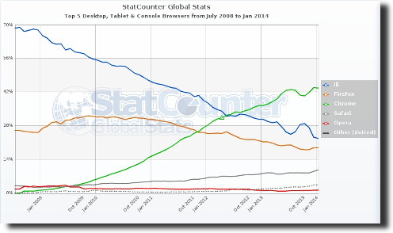

[http://gs.statcounter.com/](http://gs.statcounter.com/)

# Tecnologías de cliente

## Introducción

El cliente web por excelencia es el **navegador web**, aunque ahora existen otros clientes como pueden ser **las aplicaciones nativas de los dispositivos móviles**, ahora bien la tendencia es la de utilizar los **estándares web** en dichas aplicaciones.

Aunque la tendencia es usar cada vez más tecnologías estándares, **aún se usan otras tecnologías no estándar**.

## Estándares web

El **W3C** (World Wide Web Consortium) es una comunidad internacional que desarrolla estándares abiertos que aseguran el crecimiento de la Web a largo plazo.

**HTML** (Hypertext Markup Language) and **CSS** (Cascading Style Sheets) son dos de las tecnologías principales para la construcción de páginas web.

### HTML

HTML proporciona la **información estructurada** en secciones, párrafos, título, imágenes, etc.

La versión actual es **HTML5**, que aunque todavía no está finalizada, la mayoría de los navegadores implementan gran parte de la especificación.

Ha supuesto una revolución en el cliente pues ofrece muchas tecnologías avanzadas:

-  **Multimedia**: audio, vídeo, canvas, webgl, etc.

-  **Comunicaciones**: websockets

-  **Concurrencia**: webworkers

-  **Almacenamiento**: storage

-  **Otros**: geoposicionamiento, drag&drop, acceso a la cámara, al micrófono, etc.

### CSS

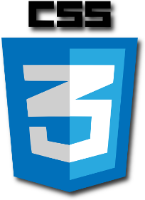

CSS proporciona la **distribución de los elementos y su estilo** (colores, tipos de letra, fondos, efectos...)

CSS es un lenguaje usado para definir la presentación de un documento estructurado escrito en HTML, XML, SVG o incluso interfaces de usuario de otras tecnologías (JavaFX)

Su versión actual es **CSS3**, que aunque todavía no está finalizada, la mayoría de los navegadores implementan gran parte de la especificación.

#### Preprocesadores

Procesan código escrito en un lenguaje “A+” (HAML, Coffeescritp, SCSS o LESS) y generan archivos escritos en otro lenguaje “A” (HTML, Javascript y CSS, respectivamente). Los lenguajes fuente son similares a los que producen, pero más sencillos de escribir (y de leer y mantener).

En el caso de CSS los preprocesadores **suplen ciertas carencias que tiene el propio lenguaje** como puede ser: variables, herencias, funciones, imports, ...

Los preprocesadores CSS más importantes son: **Sass** y **less**.

#### Frameworks CSS

Facilitan la tarea de crear sitios **Responsive Web Design** (diseño que se adapta a los distintos clientes: móvil, tablet, ordenador) mediante el uso de diseño con rejillas, uso de clases, componentes, etc.

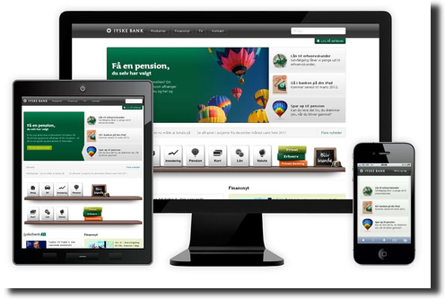

Los frameworks CSS mas importantes son: **Zurb Foundation** y **Twitter Bootstrap**.

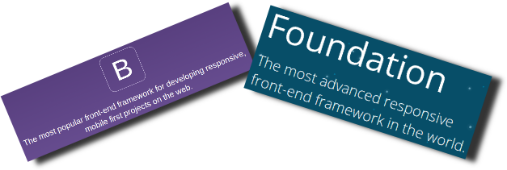

### JavaScript

Con JavaScript se **puede modificar la página y ejecutar código cuando se interactúa con ella** (a través del modelo de objetos del documento DOM)

Aunque algunos elementos de la sintaxis recuerden a Java, **no tiene nada que ver con Java**, se eligió ese nombre por razones de marketing, pues cuando se publicó Java estaba en auge.

Es un lenguaje de programación basado en el estándar **ECMAScript** de ECMA (otra organización diferente al W3C)

Hay ligeras diferencias en la implementación de JS de los navegadores, aunque actualmente todos son bastante compatibles entre sí (en el pasado no fue así)

Inicialmente era un lenguaje interpretado, pero actualmente se ejecuta con máquinas virtuales en los navegadores (velocidad de ejecución y eficiencia de memoria)

Características:

-  **Tipado dinámico** (habitual en los lenguajes de script)

-  **Funcional y orientado a objetos** (basado en prototipos)

#### Librerías JavaScript

Existen multitud de librerías JavaScript, aunque las más utilizadas son:

-  **jQuery**: aporta facilidad de uso y compatibilidad entre navegadores. Se usa para gestionar el interfaz y  peticiones ajax.

-  **underscore.js**: permite trabajar con un enfoque más funcional y permite gestionar plantillas para generar HTML.

#### Frameworks Javascript

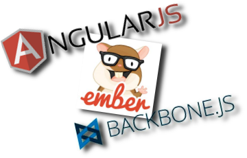

Además de librerías, también existen frameworks de alto nivel que estructuran una aplicación de forma completa, siendo los más populares: **Angular.js, Backbone.js y Ember**.

## Tecnologías no estándar en la web

La web ha avanzado y evolucionado gracias a tecnologías no estándar incluidas en los navegadores mediante plugins.

Algunas llegaron a convertirse en estándares “de facto”, como es el caso de **Adobe Flash**.

La llegada de los dispositivos móviles, consolas y televisiones conectadas (SmartTVs) y **la estandarización de HTML5 han hecho que estas tecnologías no estándar estén en desuso**.

### Adobe Flash

Es una tecnología **usada principalmente para incrustar contenido multimedia interactivo** en páginas web.

Durante muchos años fue la única forma de tener interactividad, animaciones, vídeos, juegos... en la web.

Es una tecnología **propietaria y cerrada**, y aunque es gratuita para los usuarios, no lo es para los desarrolladores y servidores.

Ha sido acusada de de que no es eficiente, no es abierta y por tanto, no es el futuro de la web (Abril 2010 - Steve Jobs por el iPhone y iPad)
 - Adobe lo ha acabado reconociendo y no seguirá apostando por Flash como la herramienta básica de la web interactiva (Nov 2011)

### Java Applets

Los applets de Java fueron **los precursores de Flash**, aunque hoy están en desuso.

### Microsoft Silverlight

La **apuesta de Microsoft para competir con Flash**, aunque hoy están en desuso.
